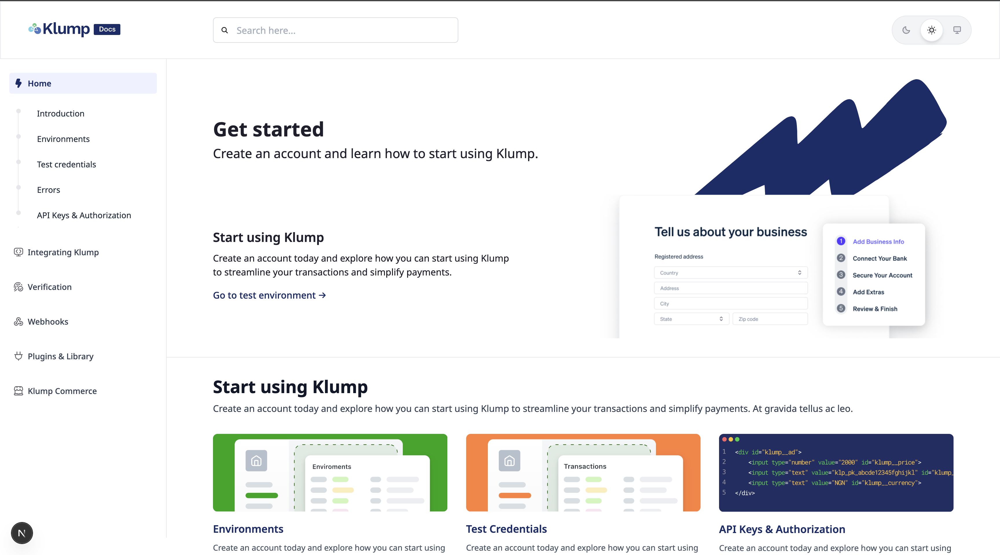

# Klump Documentation

A modern, feature-rich documentation website built with Markdoc and Next.js for Klump's API and integration guides.



## Table of Contents

- [Features](#-features)
- [Tech Stack](#-tech-stack)
- [Getting Started](#-getting-started)
- [Project Structure](#-project-structure)
- [Development](#-development)
- [Content Management](#-content-management)
- [Build & Deployment](#-build--deployment)
- [Contributing](#-contributing)
- [Support](#-support)

## 🚀 Features

- **Modern Documentation Experience**: Built with Markdoc for powerful, component-driven content authoring
- **Advanced Search**: Real-time search across all documentation with debounced queries and loading states
- **Responsive Design**: Mobile-first design that works seamlessly across all devices
- **Custom Components**: Rich set of reusable components for enhanced content presentation
- **Theme Support**: Built-in dark/light theme toggle with system preference detection
- **Table of Contents**: Auto-generated navigation for easy content discovery
- **Code Syntax Highlighting**: Prism.js integration for beautiful code blocks
- **Custom Markdoc Tags**: Extensible tag system for specialized content blocks

## 🛠 Tech Stack

- **Framework**: Next.js 13+ with TypeScript
- **Content**: Markdoc for structured, component-driven documentation
- **Styling**: Tailwind CSS for utility-first styling
- **Search**: Custom search implementation with fuzzy matching
- **State Management**: Zustand for lightweight state management
- **Code Highlighting**: Prism.js for syntax highlighting
- **Icons**: Custom SVG icon components

## 🚀 Getting Started

### Prerequisites

- Node.js 16+ 
- npm or yarn package manager
- Git
- Access to the private Klump documentation repository

### Quick Start

1. **Clone the repository:**
```bash
# Ensure you have access to the private repository
git clone https://github.com/Klump-Inc/docs.git
cd docs
```

2. **Install dependencies:**
```bash
npm install
# or
yarn install
```

3. **Start the development server:**
```bash
npm run dev
# or
yarn dev
```

4. **Open your browser:**
Navigate to [http://localhost:3000](http://localhost:3000) to view the documentation.

## 📁 Project Structure

```
├── components/           # React components
│   ├── SearchResults.tsx # Search functionality
│   ├── TopNav.tsx       # Navigation with search
│   ├── SideNav.tsx      # Sidebar navigation
│   ├── Callout.tsx      # Alert/callout components
│   ├── CodeBlock.tsx    # Code syntax highlighting
│   ├── home/            # Homepage components
│   ├── getting-started/ # Getting started components
│   ├── img/             # SVG icon components
│   ├── Layouts/         # Layout components
│   └── views/           # Page-specific view components
├── markdoc/             # Markdoc configuration
│   ├── tags/            # Custom Markdoc tags
│   │   ├── apikeys.markdoc.ts
│   │   ├── callout.markdoc.ts
│   │   ├── environment.markdoc.ts
│   │   └── ...          # Other specialized tags
│   ├── nodes/           # Custom Markdoc nodes
│   └── functions.ts     # Markdoc utility functions
├── pages/               # Next.js pages (Markdown files)
│   ├── docs/            # Documentation content
│   ├── _app.tsx         # App configuration
│   └── index.md         # Homepage
├── lib/                 # Utility libraries
│   └── search.ts        # Search implementation
├── hooks/               # Custom React hooks
│   └── useSidebarStore.ts # Sidebar state management
├── data/                # Static data files
│   └── content/         # Content data
├── deploy/              # Deployment configurations
│   └── production/      # Production deployment scripts
├── scripts/             # Build and deployment scripts
└── public/              # Static assets
    ├── globals.css      # Global styles
    └── img/             # Images and icons
```

## 🔧 Development

### Local Development Workflow

1. **Start the development server:**
```bash
npm run dev
```

2. **Make your changes:**
   - Edit Markdown files in `pages/docs/`
   - Modify components in `components/`
   - Add new Markdoc tags in `markdoc/tags/`

3. **Test your changes:**
   - The development server auto-reloads on file changes
   - Test search functionality
   - Verify responsive design

### Adding New Features

#### 1. React Components
Add new components to the `components/` directory:
```bash
# Create a new component
touch components/MyNewComponent.tsx
```

#### 2. Custom Markdoc Tags
1. Create a new tag file in `markdoc/tags/`
2. Export it from `markdoc/tags/index.ts`
3. Create corresponding React component in `components/`

Example tag structure:
```typescript
export const mytag = {
  render: MyComponent,
  attributes: {
    title: { type: String },
    type: { type: String, default: 'default' }
  }
};
```

#### 3. Utility Functions
Add utilities to the `lib/` directory and custom hooks to `hooks/`.

### Code Quality Guidelines

- **TypeScript**: Use TypeScript for all new code
- **ESLint**: Follow the existing linting rules
- **File Naming**: Use PascalCase for components, camelCase for utilities
- **Component Structure**: Keep components focused and reusable
- **Documentation**: Add JSDoc comments for complex functions

## 📝 Content Management

### Writing Documentation

1. **Create new documentation pages:**
```bash
# Create a new markdown file
touch pages/docs/my-new-page.md
```

2. **Add frontmatter for metadata:**
```yaml
---
title: "Page Title"
description: "Page description for SEO"
---

# Your Content Here
```

3. **Use custom Markdoc tags for enhanced content:**
```markdown

This is a warning callout with custom styling.



Display environment configuration

```

### Available Custom Tags

The project includes several specialized tags:

- `` - Alert boxes and callouts with different types (note, warning, help)
- `` - Enhanced data tables with sorting and filtering
- `` - Optimized image components with lazy loading
- `` - Environment configuration displays
- `` - Error code documentation tables
- `` - Webhook documentation components
- `` - API key management interfaces
- `` - Commerce integration guides
- `` - Plugin documentation

### Content Organization

- **Main docs**: Place in `pages/docs/`
- **Homepage content**: Edit `pages/index.md`
- **Static data**: Store in `data/content/`
- **Images**: Add to `public/img/`

## 🎨 Styling Guide

### Tailwind CSS

This project uses Tailwind CSS for styling:

- **Utility-first**: Use Tailwind utility classes
- **Responsive**: Mobile-first design approach
- **Consistent spacing**: Use Tailwind's spacing scale
- **Brand colors**: Custom Klump brand colors defined in config

### Design Principles

- **Accessibility**: WCAG 2.1 AA compliance
- **Performance**: Optimized for Core Web Vitals
- **Consistency**: Reusable design patterns
- **Readability**: Optimized typography for documentation

## 📦 Build & Deployment

### Production Build

Test your production build locally before deploying:

```bash
# Build the project
npm run build

# Test the production build
npm run start
```

### Pre-Deployment Checklist

- ✅ **Tailwind CSS**: Ensure all styles are properly compiled and purged
- ✅ **Environment Variables**: Set up production environment variables
- ✅ **Static Assets**: Verify all images and assets are optimized
- ✅ **Search Index**: Confirm search functionality works
- ✅ **Performance**: Test Core Web Vitals and loading speeds
- ✅ **Mobile**: Test responsive design on various devices

### Deployment Options

#### Quick Deploy

> **Note**: These deployment options require repository access permissions for private repositories.

**Vercel (Recommended)**
- Connect your Vercel account to GitHub
- Import the private repository: `https://github.com/Klump-Inc/docs`
- Configure build settings and deploy

**Netlify**
- Connect your Netlify account to GitHub
- Import the private repository
- Configure build settings and deploy

#### Self-Hosted Deployment

<details>
<summary><strong>🚀 AWS EC2 with PM2</strong></summary>

**Prerequisites:**
- AWS account with EC2 access
- Domain name (optional)
- SSL certificate (recommended)
- GitHub access token for private repository

**1. Launch EC2 Instance:**
```bash
# Launch Ubuntu 22.04 LTS instance
# Recommended: t3.medium or larger for production
# Security Group: Allow ports 22 (SSH), 80 (HTTP), 443 (HTTPS)
```

**2. Server Setup:**
```bash
# Connect to your EC2 instance
ssh -i your-key.pem ubuntu@your-ec2-ip

# Update system
sudo apt update && sudo apt upgrade -y

# Install Node.js 18.x
curl -fsSL https://deb.nodesource.com/setup_18.x | sudo -E bash -
sudo apt-get install -y nodejs

# Install PM2 globally
sudo npm install -g pm2

# Install Nginx
sudo apt install nginx -y
```

**3. Deploy Application:**
```bash
# Clone private repository (requires GitHub access)
# Option 1: Using personal access token
git clone https://github.com/Klump-Inc/docs.git
cd docs

# Option 2: Using SSH key (if configured)
# git clone git@github.com:Klump-Inc/docs.git

# Install dependencies and build
npm install
npm run build

# Create PM2 ecosystem file
cat > ecosystem.config.js << EOF
module.exports = {
  apps: [{
    name: 'klump-docs',
    script: 'npm',
    args: 'start',
    instances: 'max',
    exec_mode: 'cluster',
    env: {
      NODE_ENV: 'production',
      PORT: 3000
    }
  }]
}
EOF

# Start with PM2
pm2 start ecosystem.config.js
pm2 save
pm2 startup
```

**4. Configure Nginx:**
```bash
# Create Nginx configuration
sudo tee /etc/nginx/sites-available/klump-docs << EOF
server {
    listen 80;
    server_name your-domain.com www.your-domain.com;

    # Gzip compression
    gzip on;
    gzip_vary on;
    gzip_min_length 1024;
    gzip_types text/plain text/css text/xml text/javascript application/javascript application/xml+rss application/json;

    # Security headers
    add_header X-Frame-Options "SAMEORIGIN" always;
    add_header X-XSS-Protection "1; mode=block" always;
    add_header X-Content-Type-Options "nosniff" always;

    location / {
        proxy_pass http://localhost:3000;
        proxy_http_version 1.1;
        proxy_set_header Upgrade \$http_upgrade;
        proxy_set_header Connection 'upgrade';
        proxy_set_header Host \$host;
        proxy_cache_bypass \$http_upgrade;
    }
}
EOF

# Enable site
sudo ln -s /etc/nginx/sites-available/klump-docs /etc/nginx/sites-enabled/
sudo nginx -t
sudo systemctl restart nginx
```

**5. SSL with Let's Encrypt:**
```bash
# Install Certbot
sudo apt install certbot python3-certbot-nginx -y

# Get SSL certificate
sudo certbot --nginx -d your-domain.com
```

</details>

<details>
<summary><strong>🌐 Google Cloud Platform</strong></summary>

**GCP Compute Engine:**
```bash
# Create VM instance
gcloud compute instances create klump-docs-vm \
    --zone=us-central1-a \
    --machine-type=e2-medium \
    --image=ubuntu-2204-jammy-v20231114 \
    --image-project=ubuntu-os-cloud \
    --tags=http-server,https-server

# Configure firewall
gcloud compute firewall-rules create allow-http-https \
    --allow tcp:80,tcp:443 \
    --target-tags http-server,https-server

# SSH and follow AWS setup steps
gcloud compute ssh klump-docs-vm --zone=us-central1-a
```

**Cloud Run (Containerized):**
```dockerfile
# Dockerfile
FROM node:18-alpine AS builder
WORKDIR /app
COPY package*.json ./
RUN npm ci
COPY . .
RUN npm run build

FROM node:18-alpine AS runner
WORKDIR /app
ENV NODE_ENV production
COPY --from=builder /app/.next/standalone ./
COPY --from=builder /app/.next/static ./.next/static
COPY --from=builder /app/public ./public
EXPOSE 3000
CMD ["node", "server.js"]
```

```bash
# Build and deploy
gcloud builds submit --tag gcr.io/PROJECT-ID/klump-docs
gcloud run deploy klump-docs --image gcr.io/PROJECT-ID/klump-docs --platform managed --allow-unauthenticated
```

</details>

#### Using Project Scripts

The project includes deployment scripts for custom setups:

```bash
# Make scripts executable
chmod +x scripts/*.sh

# Setup server (first time)
./scripts/setup.sh

# Deploy application
./scripts/deploy.sh

# Start server
./scripts/server.sh
```

### CI/CD Pipeline

**GitHub Actions**:
```yaml
name: Deploy to Production
on:
  push:
    branches: [ main ]
jobs:
  deploy:
    runs-on: ubuntu-latest
    steps:
      - uses: actions/checkout@v3
      - uses: actions/setup-node@v3
        with:
          node-version: '18'
          cache: 'npm'
      - run: npm ci
      - run: npm run build
      - name: Deploy
        run: |
          # Add deployment commands
```

### Troubleshooting

**Common Issues:**

1. **Tailwind styles not loading:**
```bash
# Clear cache and rebuild
rm -rf .next
npm run build
```

2. **Search not working:**
```bash
# Check search index generation
# Verify lib/search.ts content indexing
```

3. **Build failures:**
```bash
# Check for TypeScript errors
npm run type-check

# Verify all dependencies
npm audit
```

## 🤝 Contributing

We welcome contributions from Klump team members to improve our documentation!

### Getting Started

1. **Clone the repository:**
```bash
# Ensure you have access to the private repository
git clone https://github.com/Klump-Inc/docs.git
cd docs
```

2. **Create a feature branch:**
```bash
git checkout -b feature/amazing-feature
```

3. **Make your changes:**
   - Follow the coding guidelines
   - Add tests if applicable
   - Update documentation

4. **Test your changes:**
```bash
npm run dev
# Test your changes thoroughly
```

5. **Commit and push:**
```bash
git commit -m 'feat: add amazing feature'
git push origin feature/amazing-feature
```

6. **Create a Pull Request:**
   - Use the PR template
   - Describe your changes clearly
   - Link any related issues
   - Request review from team members

### Contribution Guidelines

- **Code Style**: Follow existing TypeScript and React patterns
- **Documentation**: Update relevant documentation
- **Testing**: Test your changes across different devices
- **Performance**: Ensure changes don't negatively impact performance
- **Accessibility**: Maintain WCAG 2.1 AA compliance

### Types of Contributions

- 🐛 **Bug fixes**: Fix issues and improve stability
- ✨ **New features**: Add new functionality or components
- 📚 **Documentation**: Improve or add documentation
- 🎨 **UI/UX**: Enhance user interface and experience
- ⚡ **Performance**: Optimize speed and efficiency
- 🔧 **Tooling**: Improve development tools and processes

## 🆘 Support

### Getting Help

- **📖 Documentation Issues**: Create an issue in the private repository
- **🔧 Technical Support**: Contact the development team via Slack
- **💬 Team Communication**: Join [Klump Slack](https://useklump.com/slack)
- **🌐 Klump Platform**: Visit [Klump](https://useklump.com)
- **🛒 Klump Store**: Browse [Klump Store](https://store.useklump.com)

### Internal Resources

- **Main Website**: [useklump.com](https://useklump.com)
- **Klump Store**: [store.useklump.com](https://store.useklump.com)
- **Team Slack**: [useklump.com/slack](https://useklump.com/slack)
- **Documentation Repository**: Private GitHub repo with team access

### Reporting Issues

When reporting bugs, please include:
- OS and browser information
- Steps to reproduce
- Expected vs actual behavior
- Screenshots if applicable
- Environment (development/staging/production)

## 📄 License

This project is proprietary to Klump Inc. All rights reserved.

## 🔄 Changelog

### Recent Updates

- ✅ Advanced search functionality with real-time results
- ✅ Enhanced navigation with responsive design  
- ✅ Custom Markdoc tags for specialized content
- ✅ Improved mobile experience
- ✅ Code syntax highlighting with Prism.js
- ✅ Performance optimizations

### Roadmap

- 🔄 Enhanced search with filters and sorting
- 🔄 Interactive API explorer
- 🔄 Multi-language support

---

**Built with ❤️ by the Klump team**

**Klump Resources:**
- 🌐 [Main Website](https://useklump.com)
- 🛒 [Klump Store](https://store.useklump.com)
- 💬 [Team Slack](https://useklump.com/slack)

[](https://markdoc.dev)
[](https://nextjs.org)
[](https://tailwindcss.com)
